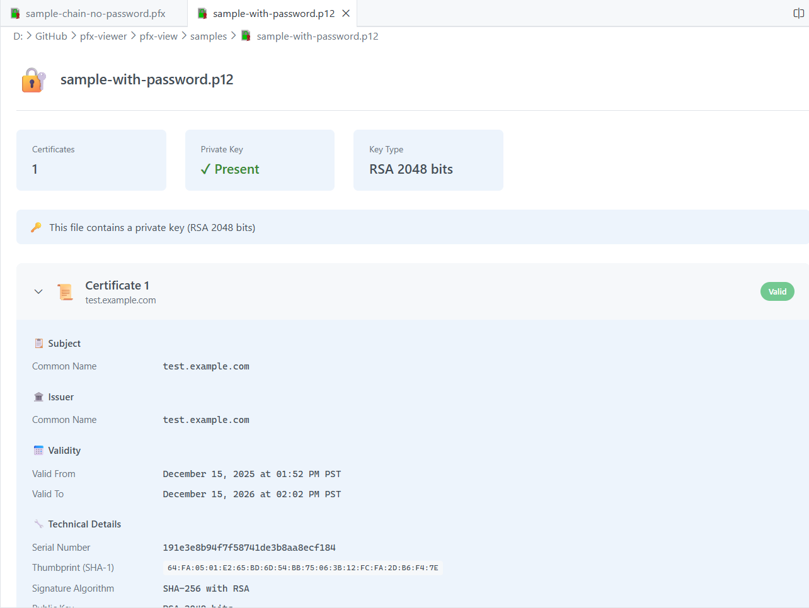

# PFX/P12 Viewer

A Visual Studio Code extension that provides a beautiful, read-only viewer for PFX/P12 certificate files.

## Features

- **🔐 View Certificate Details**: Open any `.pfx` or `.p12` file directly in VS Code to see certificate information
- **📋 Certificate Information**: View subject, issuer, validity dates, serial number, thumbprint, and more
- **🔑 Private Key Detection**: See if the file contains a private key and its type
- **📅 Expiry Status**: Visual indicators for valid, expiring soon, or expired certificates
- **🔌 Extensions**: View certificate extensions like Key Usage, Subject Alternative Names, and more
- **🔒 Password Support**: Automatically prompts for password when opening password-protected files
- **📋 Copy to Clipboard**: Click on values like thumbprint or serial number to copy them

## Usage

Simply open any `.pfx` or `.p12` file in VS Code. The extension will automatically display the certificate information in a formatted viewer.

If the file is password-protected, you'll be prompted to enter the password.

### Certificate Overview
The viewer shows a summary of all certificates in the file, including:
- Number of certificates
- Whether a private key is present
- Key type and size

### Certificate Details
Expand each certificate to see:
- Subject information (Common Name, Organization, etc.)
- Issuer information
- Validity period with expiry status
- Technical details (Serial Number, Thumbprint, Signature Algorithm, Public Key)
- Extensions (Key Usage, Extended Key Usage, Subject Alternative Names, etc.)

## Supported File Types

- `.pfx` - Personal Information Exchange
- `.p12` - PKCS #12 Archive

## Requirements

No additional requirements. The extension bundles all necessary dependencies.

## Extension Settings

This extension does not add any VS Code settings.

## Known Issues

- Some exotic certificate extensions may not be fully parsed and will display as raw values
